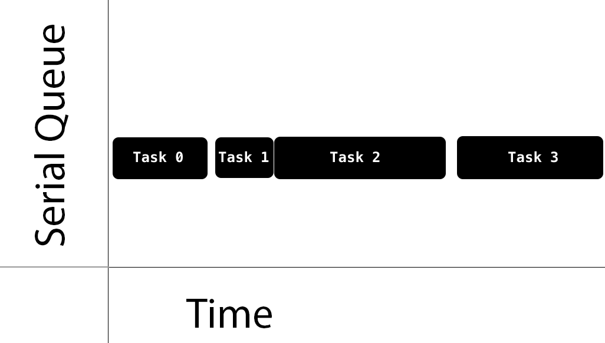
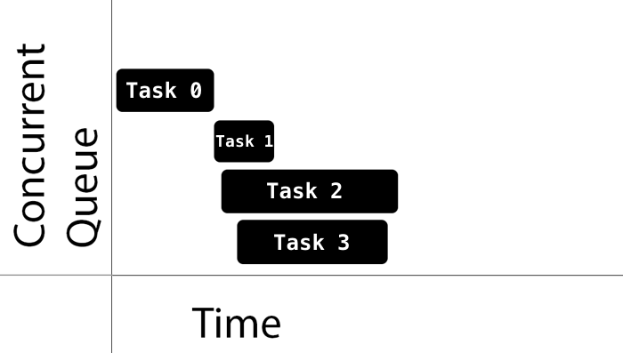
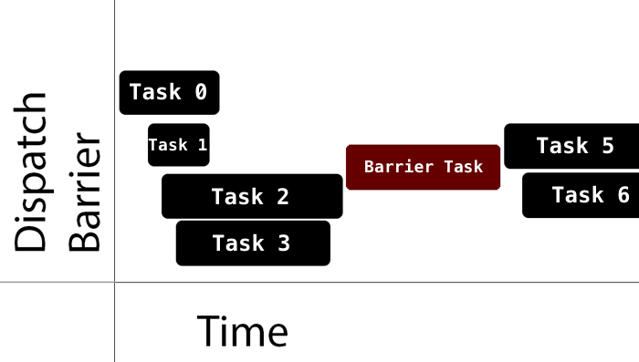

### Concurrency

iOS 中一个应用进程可以有多个线程。操作系统管理每个线程，每个线程都**可以**并发地执行，但是操作系统决定是否会同时执行，什么时候，以及如何实现。

单核处理器设备通过 **time-slicing(时间片)** 实现，执行一个线程，执行上下文切换，再执行另一个线程。

多核处理器设备，通过 **parallelism(并行)** 同时执行多个线程。


GCD 建立在线程之上，它维护着一个线程池。在 GCD 中通过代码块添加任务到 **dispatch queues** 然后 GCD 决定用哪个线程去执行它们。

GCD 根据系统和可用的系统资源来决定有多少个并行。

> 并行需要并发，但是并发并不保证并行

**并发并行的区别**

>concurrency is about *structure* while parallelism is about *execution*

### Queues

GCD 以 FIFO 的顺序执行添加进队列的任务，保证先添加进队列的任务比后添加进队列的任务先**开始**执行。

Dispatch queues 是线程安全的，可以多线程同时存取队列。

队列分为**串行**队列和**并发**队列。

串行队列保证在某一时刻只有一个任务在执行，GCD 控制执行时间，你不能确定在任务之间的间隔时间。



并发队列可以让多个任务在同一时间执行。任务开始执行的顺序还是遵守 FIFO 的规则，任务结束的顺序是不确定的，开始两个任务的时间间隔也是不确定的，同时执行的任务数量也是不确定的。



当两个任务的执行时间重叠时，GCD 会决定是否在多核上执行或者通过时间片的方式执行。

GCD 提供三种主要类型的队列：

1. **Main queue**：在主线程执行并且是一个串行队列
2. **Global queues**: 整个系统共享的并发队列，共有四个不同优先级的队列：`high, default, low, background` 。background 优先级的 queue 在 I/O 活动中被限制以减少对系统的负面影响。
3. **Custom queues**: 可以是串行或者并发队列，*这些队列中的请求最终会在一个全局队列中*

全局队列的优先级属性在 iOS8 上被废弃，替代的方式是使用 QoS。

1. **User-interactive**: 任务必须马上完成以提供一个好的用户体验。
2. **User-initiated**: 用户从UI操作开始这些异步操作。用于用户等待立即的结果和被用户交互依赖的任务。对应 `high` 优先级全局队列。
3. **Default**: 默认，QoS 参数省略时的默认值，对应 `default` 优先级全局队列。
4. **Utility**: 长时间运行的任务，典型的应用是用户可见的进度指示器。可用于计算、I/O、网络、持续数据流等。对应 `low` 优先级全局队列。
5. **Background**: 用户没有意识到的任务。可用于预加载、维护、其它的无用户交互的/非是时间敏感的任务。对应 `background` 优先级的全局队列。

### Synchronous vs. Asynchronous

同步方法在任务完成之后将控制返回给调用者。

异步方法立刻返回，保持任务开始的顺序，但是不会等待任务的结束。因此，异步方法不会阻塞当前的线程执行下一个方法。

**什么时候用 async**

1. **Main Queue**: 子线程结束任务后更新UI可以通过主队列和 async 保证更新UI的操作会在当前方法执行完成之后的某个时刻执行
2. **Global Queue**: 普通非UI操作
3. **Custom Serial Queue**: 连续的后台任务。串行队列一个时刻只有一个任务在执行，解决了资源竞争问题。

**什么时候用 sync**

1. **Main Queue**: 注意死锁的情况
2. **Global Queue**: 可用在 dispatch barrier 中同步任务，或者等待一个任务完成之后再进行其它的操作
3. **Custom Serial Queue**: 注意死锁

### Managing Tasks

GCD 用闭包的方式添加任务，每个提交给 `DispatchQueue` 的任务都是一个 `DispatchWorkItem` 。

可以设置  `DispatchWorkItem` 的 `QoS` 或者是否产生新的线程等。

### Delaying Task Execution

用于希望任务在特定时间运行的时候。

> 可以用在给新启动app的用户一些提示，如果提示太早可能用户关注点在其它地方而忽略了这个提示，所以可以用延时任务完成

```swift
// 1
let delayInSeconds = 2.0

// 2
DispatchQueue.main.asyncAfter(deadline: .now() + delayInSeconds) { [weak self] in
  guard let self = self else {
    return
  }

  if PhotoManager.shared.photos.count > 0 {
    self.navigationItem.prompt = nil
  } else {
    self.navigationItem.prompt = "Add photos with faces to Googlyify them!"
  }

  // 3
  self.navigationController?.viewIfLoaded?.setNeedsLayout()
}
```

**为什么不用 Timer**

1. 可读性，Timer 需要定义一个方法，然后使用定义的方法为 selector 创建一个 Timer。GCD 方法只需要闭包
2. Timer 依赖于 runloop，所以使用 Timer 需要保证它被添加进正确的 runloop mode。
3. Timer 更适合用在需要重复的任务

### Handling the Readers-Writers Problem

可以通过 dispatch barriers 解决[Readers-Writers Problem](http://en.wikipedia.org/wiki/Readers–writers_problem)

当提交 `DispatchWorkItem` 到队列的时候，可以设置一个标识来表示这个任务在执行的时候所在队列只有这个任务在执行。

1. 所有 dispatch barrier 之前的任务都执行完成之后这个 `DispatchWorkItem` 才会执行
2. 当这个`DispatchWorkItem` 执行的时候，所在队列只有这个任务在执行
3. `DispatchWorkItem` 执行完成之后，所在队列回到默认的表现



> 全局队列为共享，在全局队列中使用 barrier 需要注意
>
> 在自定义的并发队列中使用 barrier 实现线程安全是比较好的实践

barrier 解决了写的问题，在同一个队列进行读操作，但是使用 `sync` 方法来保证方法返回读到数据。

> 当需要**等待**任务结束之后再使用任务闭包处理的数据时，使用  sync

> **死锁 deadlock**
>
> 如果在执行的队列上调用 sync 会导致死锁
>
> sync 会等待闭包执行完成，但是闭包在当前执行的闭包调用完成之前不会调用完成或者调用，但是当前执行的闭包又在等待 sync 的闭包调用结束。